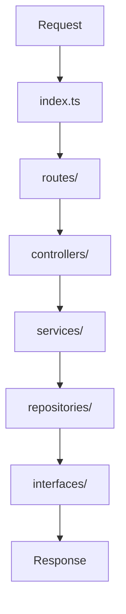

# 🛒 Shopee – Ejercicio Técnico

<div align="center">


</div>

---

## 📋 Descripción

Este proyecto es una aplicación web completa que implementa un sistema de gestión de productos con funcionalidades de búsqueda y filtrado. Desarrollado con una arquitectura moderna que separa claramente el **backend** y **frontend**, utilizando las mejores prácticas de desarrollo.

### 🎯 Características principales:
- **Backend**: API REST desarrollada en Node.js con TypeScript
- **Frontend**: Aplicación React con Vite y Redux Toolkit para gestión de estado
- **Arquitectura**: Patrón de capas (layered/onion architecture)
- **Tipado**: TypeScript en ambos extremos para mayor robustez

---

## 📌 Objetivo

- ✅ Crear un **GET** para obtener datos (API o función simulada)
- ✅ Guardar esos datos en un **List<obj>** (`Array<Object>` en JS)
- ✅ Implementar un **search** sobre esa lista
- ✅ Mostrar los resultados en el frontend con interfaz moderna

---

## ⚙️ Stack Tecnológico

### Backend
- **Node.js** con **TypeScript**
- **Express.js** para el servidor HTTP
- Arquitectura en capas (Controllers, Services, Repositories)

### Frontend
- **React 18** con **TypeScript**
- **Vite** como build tool y dev server
- **Redux Toolkit** para gestión de estado global
- **Tailwind CSS** para estilos

---

## 🏗️ Estructura del Proyecto
```
Shopee-Tecnico-Escrito/
├── Client/                     # 🎨 Aplicación frontend
│   ├── src/
│   │   ├── assets/            # Recursos estáticos
│   │   ├── pages/             # Páginas principales
│   │   │   └── products/      # Página de productos
│   │   ├── components/        # Componentes reutilizables
│   │   │   ├── ProductCard.tsx
│   │   ├── redux/             # Configuración de Redux
│   │   │   ├── ProductSlice.tsx
│   │   │   ├── Hooks.tsx
│   │   │   └── ProductStore.tsx
│   │   ├── services/          # Servicios para comunicación con API
│   │   │   └── ProductService.tsx
│   │   ├── App.tsx           # Componente principal
│   │   ├── main.tsx          # Punto de entrada
│   │   └── globals.css       # Estilos globales
│   ├── package.json          # Dependencias del frontend
│   ├── vite.config.ts        # Configuración de Vite
│   ├── tailwind.config.cjs   # Configuración de Tailwind
│   └── tsconfig.json         # Configuración de TypeScript
│
├── Server/                    # 🖥️ API Backend
│   ├── controller/           # Controladores de la API
│   │   └── product.controller.ts
│   ├── routes/              # Definición de rutas API
│   │   └── product.routes.ts
│   ├── services/            # Lógica de negocio
│   │   └── product.service.ts
│   ├── repositories/        # Acceso a datos
│   │   └── product.repository.ts
│   ├── interfaces/          # Tipos TypeScript
│   │   └── product.ts
│   ├── index.ts            # Punto de entrada del servidor
│   ├── package.json        # Dependencias del backend
│   └── tsconfig.json       # Configuración de TypeScript
│
└── README.md               # 📖 Documentación
```


## 🔄 Flujo de Trabajo

### Backend (Arquitectura en Capas)


1. **Request** entra por `index.ts`
2. Se dirige al archivo correspondiente en `routes/`
3. Pasa al `controller` relacionado
4. El controller llama al `service` adecuado
5. El service interactúa con el `repository`
6. El repository devuelve una Promise que cumple con la `interfaz` definida

---

## 🚀 Instrucciones de Ejecución

### 🖥️ Backend (Server)
```bash
# Navegar al directorio del servidor
cd Server

# Instalar dependencias
npm install

# Iniciar el servidor en modo desarrollo
npm start
```

### 🎨 Frontend (Client)
```bash
# Navegar al directorio del cliente
cd Client

# Instalar dependencias
npm install

# Iniciar la aplicación en modo desarrollo
npm run dev
```

---

## 📡 API Endpoints

| Método | Endpoint | Descripción |
|--------|----------|-------------|
| `GET` | `/api/products` | Obtiene la lista completa de productos |

---

## 🌟 Características Implementadas

- ✅ **API REST** con TypeScript
- ✅ **Interfaz moderna** con React y Tailwind CSS
- ✅ **Gestión de estado** con Redux Toolkit
- ✅ **Búsqueda en tiempo real** de productos
- ✅ **Arquitectura escalable** y mantenible
- ✅ **Tipado fuerte** en todo el proyecto

---

## 👨‍💻 Desarrollador

<div align="center">

**Antelo Santino**

*Full Stack Developer*

---

</div>